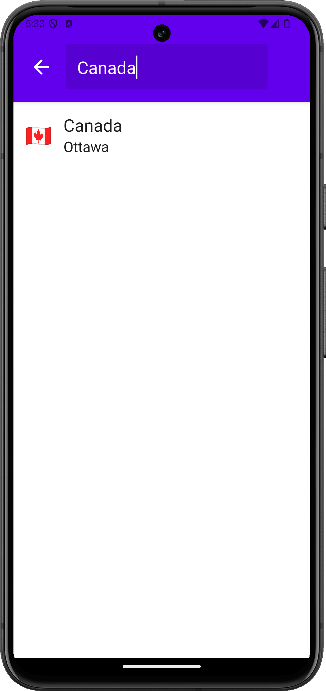

# World Countries App

An Android app that displays country details and view a selected country on a map.

## Demo

## Countries List View

## Countries Filter View

## Country Details View

## Country Map View

## Tech Stack
- Kotlin
- GraphQL
- Jetpack Compose
- Apollo Kotlin
- Hilt
- JUnit
- Mockito
- GitHub Actions

## Resources
- [Countries GraphQL API](https://studio.apollographql.com/public/countries/variant/current/home)
- [OpenStreetMap Android](https://github.com/osmdroid/osmdroid)
