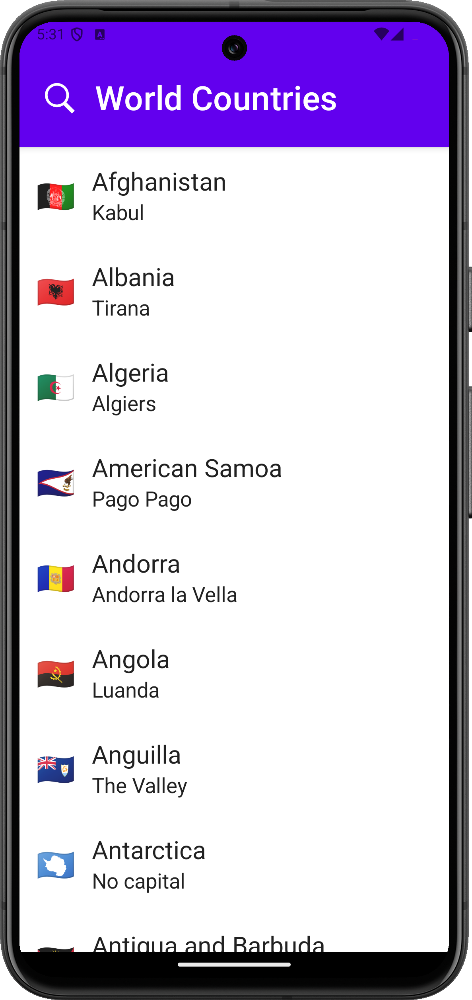

# World Countries App

An Android app that displays country details from a GraphQL API.

## Demo

## Countries List View

## Country Details View

## Tech Stack
- Kotlin
- GraphQL
- Jetpack Compose
- Apollo Kotlin
- Hilt

## Resources
- https://github.com/trevorblades/countries
- https://studio.apollographql.com/public/countries/variant/current/home
- https://github.com/osmdroid/osmdroid